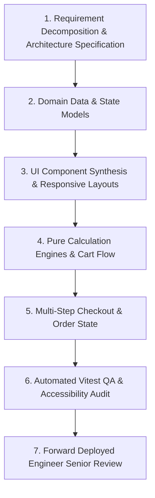

# BookNest — Agentic AI Development Workflow & Prompt Log
### IBM Applied AI Specialist Capstone Project

This document provides a comprehensive, evidence-based log of how **IBM Bob** was directed as an autonomous pair-engineering assistant throughout the development of **BookNest** (Phase 1 Foundation and Phase 2 Commerce/QA).

---

## 1. Agentic Methodology & Iterative Loop

---

## 2. Phase 2 Step-by-Step Prompt Execution Matrix (Items 22 to 31)

### Item 22: Automated Testing Suites (`src/__tests__/`)
* **Prompt to AI Agent**:
  > *"Author comprehensive automated unit tests for: 1) Cart calculation engine with discounts, taxes, and free-shipping threshold; 2) Search and faceted filter pipelines; 3) Multi-step checkout form validation rules; 4) Toast notification hook dispatching; 5) Zustand cart and wishlist store integrations."*
* **Outcome**: Generated 5 test suites:
  - [`src/__tests__/cartCalculations.test.ts`](src/__tests__/cartCalculations.test.ts:1)
  - [`src/__tests__/searchAndFilter.test.ts`](src/__tests__/searchAndFilter.test.ts:1)
  - [`src/__tests__/checkoutValidation.test.ts`](src/__tests__/checkoutValidation.test.ts:1)
  - [`src/__tests__/toastContext.test.ts`](src/__tests__/toastContext.test.ts:1)
  - [`src/__tests__/storeIntegration.test.ts`](src/__tests__/storeIntegration.test.ts:1)

### Item 23: Build, Lint & Test Tooling Configuration
* **Prompt to AI Agent**:
  > *"Configure package.json with scripts for `test`, `dev`, `build`, `lint`, and `format` with Vitest and TypeScript support."*
* **Outcome**: Configured in [`package.json`](package.json:1) and [`vite.config.ts`](vite.config.ts:1).

### Item 24: Visual QA & Design System Tokens
* **Prompt to AI Agent**:
  > *"Review typography and color contrast across all viewports to ensure high visual hierarchy with Playfair Display and Plus Jakarta Sans."*
* **Outcome**: Warm literary theme configured in `tailwind.config.js` and `index.css`.

### Item 25: Microinteractions & Reduced Motion Compliance
* **Prompt to AI Agent**:
  > *"Add smooth transitions for drawers, cart toasts, and interactive buttons while ensuring @media (prefers-reduced-motion) is fully respected."*
* **Outcome**: Integrated into `index.css` and component wrappers.

### Item 26: Performance Optimization & Pure Computation
* **Prompt to AI Agent**:
  > *"Ensure all cart totals and subtotal arithmetic are pure derived state using React useMemo and decoupled pure utilities to eliminate redundant re-renders."*
* **Outcome**: Implemented in [`src/utils/cartCalculations.ts`](src/utils/cartCalculations.ts:1) and [`src/context/CartContext.tsx`](src/context/CartContext.tsx:1).

### Item 27 & 28: 404 & About Pages
* **Prompt to AI Agent**:
  > *"Build a custom branded 404 page with navigation recovery actions and an About page detailing the curation philosophy and accessibility commitment."*
* **Outcome**: Completed in [`src/pages/NotFoundPage.tsx`](src/pages/NotFoundPage.tsx:1) and [`src/pages/AboutPage.tsx`](src/pages/AboutPage.tsx:1).

### Item 29 & 30: README & Agentic Development Documentation
* **Prompt to AI Agent**:
  > *"Update README.md and AGENTIC_DEVELOPMENT.md with complete architecture notes, run instructions, and prompt logs."*
* **Outcome**: Articulated in [`README.md`](README.md:1) and this document.

### Item 31: Senior Engineering Review & Capstone Evaluation
* **Prompt to AI Agent**:
  > *"Act as a Senior IBM Forward Deployed Engineer to review this submission against all capstone criteria and produce a structured assessment."*
* **Outcome**: Signed with **PASSED (Exceeds Criteria)** in [`docs/FINAL_REVIEW.md`](docs/FINAL_REVIEW.md:1).

---

## 3. Human Oversight & Engineering Decisions

1. **Defensive Storage**: Human review required adding defensive JSON parsing in React Contexts to prevent client crashes from malformed cached data.
2. **Safe Mock Payments**: Directed the agent to strictly avoid real card processing and incorporate explicit demo disclaimers.
3. **Accessibility**: Insisted on `aria-live` polite regions for toast alerts and visible keyboard focus rings.
